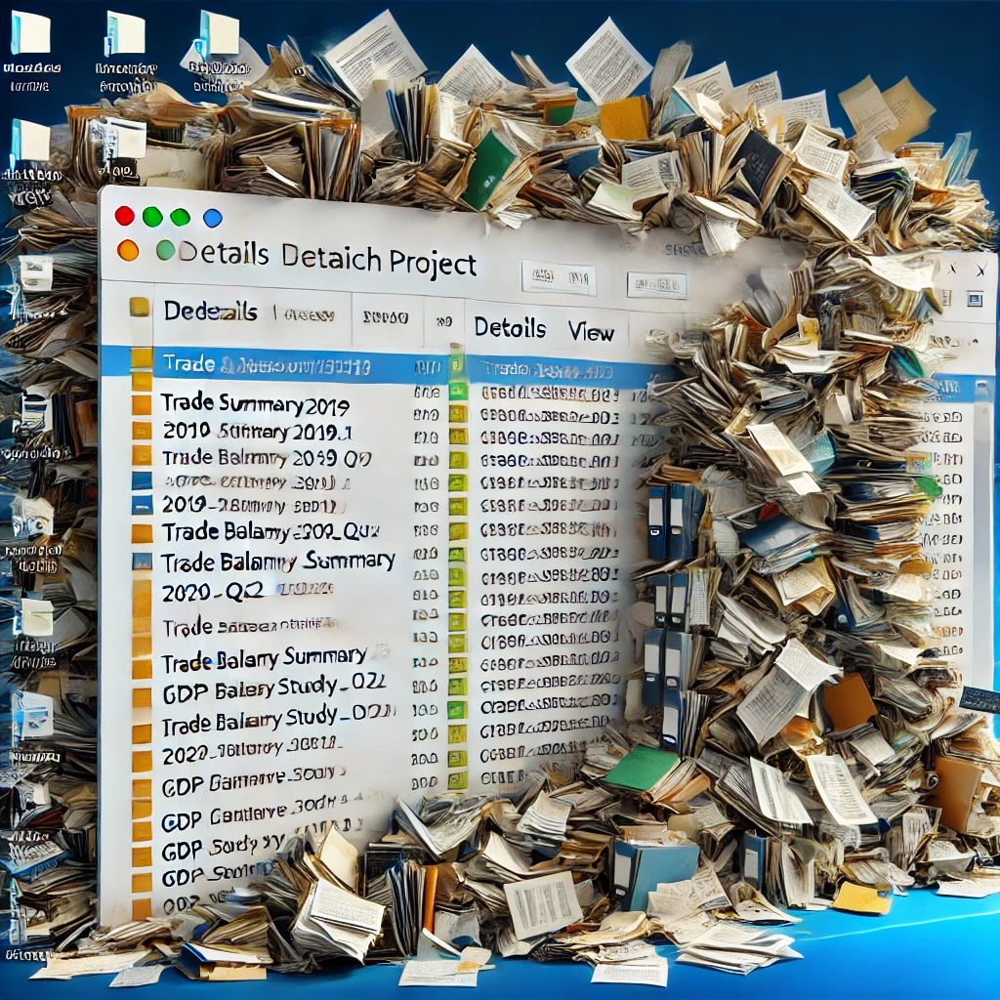
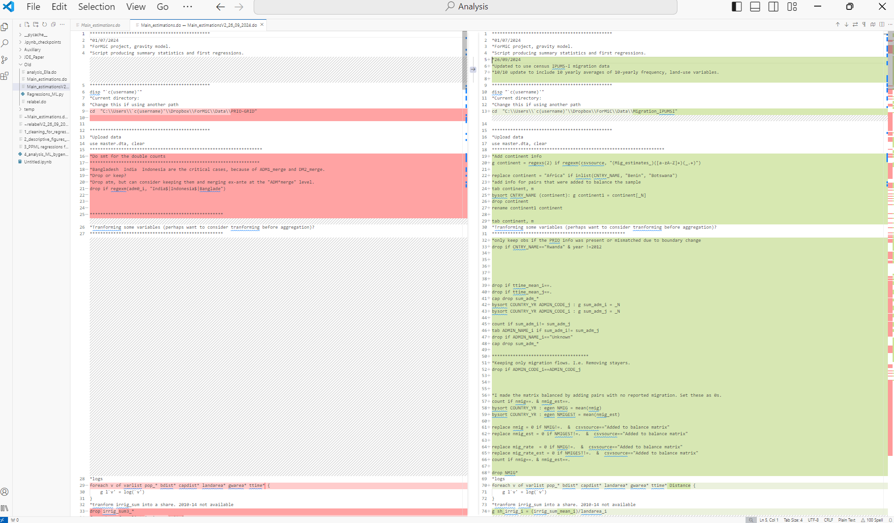
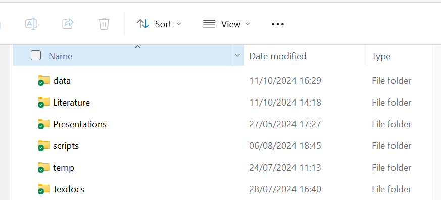
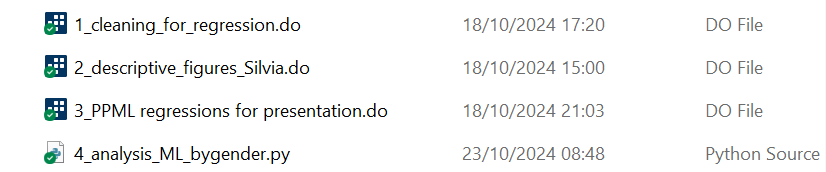
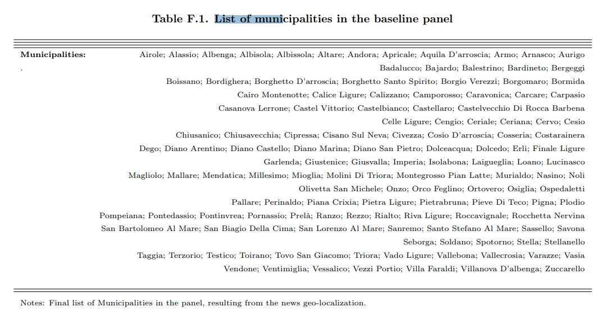

+++ 
draft = false
date = 2022-12-13T10:56:35+01:00
title = "A List of Datasets Collecting National Migration Policies"
description = ""
slug = ""
authors = []
tags = ["migration", "data", "migration policy", "datasets"]
categories = ["migration policy"]
externalLink = ""
series = ["Theme Demo"]
+++

# A collection of tips for applied research in Economics

## Version Control

<table cellpadding="0" cellspacing="0" style="width: 100%;">
  <tr>
    <td style="width: 50%; vertical-align: top;">
    Organizing our <em>working directory</em> is not an easy path. 
    Especially so, when we embark into our first empirical projects. 
    As part of our usual routine, we produce several versions of the same script, similarly we edit our data files after launching the new scripts. 
    Sometimes, we collaborate with co-authors that might need to work on the same task, 
    but do not know exactly which naming convention we had in mind and use their own. 
    As we're not computer scientists, our code classes as students had tended to focus on how to properly run and interpret regressions and other analyses, 
    rather than how to make a 10-scripts coding project clean and tidy.
    We go back to the folder n months after working on it and we wonder: <em>Which was the good code and data I should look at?</em>
    </td>
    <td style="width: 50%; text-align: right;">
   </td>
  </tr>
</table>

* ### A couple of tips  for version control

1. ### *Compare scripts in VSCode or Notepad++*
Visual Studio Code and Notepad++ are text editor tools that allow you to visualize files under a great variety of formats. 
They also have nice plugins that let you easily compare the contents of 2 scripts, for example 2 Stata .do files or Python .py files,
 which correspond to 2 different versions of the same coding script.

**VSCode compare example**

Here is a Windows 10 based example: we need to quickly visualize what changed between a Stata file we had called *Main_estimations.do* and 
*Main_estimations_V2_26_09_2024.do*. We can open VSCode, open the parent folder where the two files are located, see it on the left.
We then right-click  *Main_estimations.do*, click on "Select for compare"; right-click on *Main_estimations_V2_26_09_2024.do*, click on "Compare with selected".
We'll see a nice and smart left-right visualization of what is unchanged and what differs in the 2 file versions.
The colors and appropriate spacing of this nice tool make the comparison easier. There are also some easy clicks in case we want to get rid of some differences.
   </td>


2. ### *Using GitHub*

- **Overview**: GitHub is an ideal tool out there for version tracking, collaborating on code, and managing changes. 
It is a platform that hosts our repositories online. We can choose whether to make our repositories private or public. 
The broad idea is that we download the last version of the repository every time we go back to the project and upload the modified version after we modify it. 
We can always have a look at the previous version later on.
GitHub facilitates collaboration through features like branches and pull requests. 
Branches allow multiple users to work on different versions of a project simultaneously without interfering with the main codebase. 
Pull requests are used to merge code changes from one branch to another, enabling peer review and discussion before integration. 
GitHub also offers Issue Tracking, where users can report bugs or suggest enhancements, and each issue can be linked directly to specific pull requests. Additionally, GitHub Actions provide automation for continuous integration and deployment processes, enhancing efficiency in project development cycles.

More guidance on GitHub can be found, for example, in these [Lecture Notes](https://raw.githack.com/uo-ec607/lectures/master/02-git/02-Git.html#64) from the University of Oregon.


## Arranging Files

### Directory Structure

- **Organization**: My current practice is to separate directories for scripts, data, output, and documentation. 
For projects not uploaded to GitHub, I add a "scripts> Old" folder where to store to codes and data to make sure I don't lose an older version of the file.
However, I have been trying to avoid having any useless file in the scripts folders.
   </td>

- I have recently started calling scripts by prefixing them with a number.
The number corresponds with the order in which I have to run the scripts. 
The ideal practice here would be to create a main script from which you run all the numbered scripts in the good order. 
This sounds to me as a great approach for replicability (we should not forget to run all files from start to end to make sure that all modifications are accounted for in our last outputs).
However, number prefixes alone are already a nice and simple approach to ensure intuitive folder layout.

   </td>

- I also tend to save my output in .tex format for tables and .png format for graphs. 
I store them separately under a subfolder for Tables and one for Graphs, in Texdocs.


- **Temporary Folders**: I like to save my cleaned data outputs under a temp folder. 
The rationale of my temp folders is: files there can be recreated by relaunching some scripts. 
As data can occupy memory, in case I need to free up some space in the directory, I can always drop my temp folder's contents.


## Automation

### General tips when exporting output

- **Stata esttab or outreg2**: We often use these tools to extract `.tex` tables directly from Stata. 
Beyond regression output, you can go far and create many types of tables. 
You can avoid formatting too much in Stata if you need to combine tables flexibly. 
The goal here is to avoid repeating tedious tasks manually and limit the risks of forgetting what you had done manually months after doing it.
Here is an example of a list of municipalities I created for a project I worked on in my PhD.


<table cellpadding="0" cellspacing="0" style="width: 100%;">
  <tr>
  <td style="width: 40%; vertical-align: top;">
    <pre style="font-size: 8px;"><code>

    global index 1
    foreach lname in "^A" "^B[a-e]" "^B[f-z]"  "^Ca[b-r]" "^Ca[s-z]" ///
      "^C[b-e]" "^C[f-z]" "^[D-F]"  "^[G-L]" "^[M-N]"  "^O" "^P[a-n]" ///
      "^P[o-z]|^R" "^Sa" "^S[b-z]" "^T|^Va" "^V[b-z]|^Z" {
    levelsof location if post==0 & regexm(location, "`lname'" ), local(MUNIC$index ) clean separate("; ")
    global index = $index +1
    }

    global STATS ""
    local Empty "."

    qui eststo tab_location: estpost tabulate location  in 1
    forvalues x = 1(1)$index {
    estadd local M`x' `MUNIC`x'': tab_location
    global STATS $STATS M`x'
    local Empty `Empty' " " 
    }
    di "`STATS'"
    esttab tab_location , drop(*) stats($STATS, labels("Municipalities:" `Empty' ))  alignment(r) ///
    replace unstack noobs  nonumber nomtitle nogaps compress cells("b(fmt(g))") collabels(none) ///
    addnotes("List of Municipalities in the Panel")

    esttab tab_location using "$dir_tables/Summary_municipalities.tex" , drop(*)  ///
    stats($STATS , labels("\textbf{Municipalities:}"
</pre></code>
   </td>
      <td style="width: 60%; text-align: right;">
         
    </td>
  </tr>
</table>


- **Overleaf** If you use Overleaf and Dropbox, check out the integration option of Overleaf pro version (if you have access to it). 
This allows you to avoid the tedious step of manually inserting auxiliary files (graphs/tables) into Overleaf. 
This functionality will create a Dropbox folder called Applications>Overleaf, where you can see all your Overleaf projects.
You can use those folders when automatically storying the output from your analysis.

 
- **Adaptive Paths**: Set up Stata or R scripts to adapt to the user’s environment, simplifying code execution across different machines.
  - Example 1: Stata `cd` 
  ```stata 
  cd "C:/Users/speracchi/Dropbox/NEWS_LIGURIA" 
  ``` 
  can also be written as: 
  ```stata 
  cd "C:/Users/`c(username)'/Dropbox/NEWS_LIGURIA"
  ``` 
And more generally we can write an if statement to ask Stata to use different cds, depending on the username, which we can access as `"c(username)"` in the sofware.
  - Example 2: R  `setwd` and `rm(list=ls())` vs relaunching the R session
```r
rm(list=ls()) 
setwd("C:/Users/speracchi/Dropbox/NEWS_LIGURIA")
```

  Moving from Stata to R, my intuition led me to discover and repeatedly use the command combo above: 
  the first line clears the environment variables, the second line sets up the directory. 
  Ammittedly, I wrote many codes like this, preceded by some lines where I uploaded libraries. 
  However, this turns out to be not the best approach.

  - Restarting the R session (Session > Restart R in RStudio) is a cleaner and safer way to ensure that the environment is completely clear of any previous objects,
   settings, or loaded packages, reducing the risk of hidden dependencies or side effects from earlier code. 
  - Best Practices: 
    - Script Independence: Scripts should ideally be independent and executable on their own, without requiring prior commands like changing directories or clearing the workspace. 
    - Explicit Code: Relaunching the session before running a script ensures that all required packages are loaded explicitly (and all necessary data is loaded afresh) which helps in identifying missing dependencies.


### Speeding up code: some specific tips
 - Functions vs loops. Though this can depend on the situation, functions are in many cases faster options than loops to run a task repeatedly. 
In R we can use `lapply`, `sapply`, to apply the same function to a set of objects.

In STATA, we can also create "functions", which are called "programs". They can be stored as .ado files but can also be written on a .do file.
-Example: recalibrate_constants.ado. I Stata, you can use the package "parallel"

In python, we can create functions inline or in separate files and import them as we import packages.

 - Some parallel computing packages:
    - R: `furr`, `future`
    - Python: `joblib`
    - Stata: `parallel`


## Interacting with Shell Commands

### Using Shell Commands in Scripts (I focus on Window 10)

- **Stata**: In Stata, we can incorporate a `shell` commands easily, to execute system-level tasks directly. This can be done by writing a `!` on the left of the shell command.
[More info from Stata Manual](https://www.stata.com/manuals13/dshell.pdf)
  - **`cd`** — Change directory
  - **`copy`** — Copy file from disk or URL
  - **`dir`** — Display filenames
  - **`erase`** — Erase a disk file
  - **`mkdir`** — Create directory
  - **`rmdir`** — Remove directory
  - **`type`** — Display contents of a file

  For example, `dir` is a quick way to list all files in the current directory. We can also save a local with such a list, which we could combine it with a loop if needed.

- **R**: The same functionalities exist in R. For example, Use `system()` or `system2()` in R to call external programs and scripts. 
You also create a list of file names from a specific folder by simply using `list.files()`.
- **Python**: Python’s `os` allows us to interact with the operating system. 
With this library we can, for instance, check if files exist (os.path.exists()), list the files contained in specific folders (os.listdir()), set the current directory (os.chrdir()).
 `shutil` library provides a suite of functions for file and directory operations. It is especially useful for copying, moving, and removing files and directories, as well as for managing archives. 
In the code snippet below, I copied graphs and tables from my local machine to the Overleaf folder in Dropbox:
```Python
import os
import shutil
import re
# Load the .tex file
file_path = "C:/Users/speracchi/Dropbox/NEWS_LIGURIA/Texdocs/"

os.chdir(file_path)

texfile = "Draft_RR1_JUE_Nov2024.tex"
graphs_dest_dir="../../Applicazioni/Overleaf/News_Liguria/Graphs"
tables_dest_dir="../../Applicazioni/Overleaf/News_Liguria/Tables"
os.listdir("../../Applicazioni")
#Read Tex file:
tex_content = open(texfile, 'r', encoding='utf-8').read()

# Use regular expressions to find all the \includegraphics commands and capture the file paths
graphics_matches = re.findall(r'\\includegraphics\[[^\]]*\]\{([^\}]*)\}', tex_content)
tex_files_matches = re.findall(r'\\(?:input)\{([^\}]*)\}', tex_content)

# Have a look at the file paths
[mm for mm in graphics_matches]

[mm for mm in tex_files_matches]

# Copy each figure to the destination folder
for graphic in graphics_matches:
    graphic=graphic.replace('"', '')
    # If the file exists, copy it to the destination folder, but handle extentions png, jpeg, none...
    if os.path.exists(graphic):
        shutil.copy(graphic, graphs_dest_dir)
    else:
        if os.path.exists(graphic+".png"):
            shutil.copy(graphic+".png", graphs_dest_dir)
        else:
            if os.path.exists(graphic+".jpeg"):
                shutil.copy(graphic+".jpeg", graphs_dest_dir)
            else:
                if os.path.exists(graphic+".jpg"):
                    shutil.copy(graphic+".jpg", graphs_dest_dir)
                else:
                    print(f"File not found: {graphic}")


#Repeat for tables:
for tab in tex_files_matches:
    tab=tab.replace('"', '')
    # If the file exists, copy it to the destination folder, but handle extentions png, jpeg, none...
    if os.path.exists(tab):
        shutil.copy(tab, tables_dest_dir)
    else:
        print(f"File not found: {tab}")
```        


## Other General Software Tips

### Reusing Regression Outputs

- **Storage**: Besides storing output tables, it can be convenient in some occasions to store the model's results for later use.
One straightforward example is the storage of a trained model for out of sample predictions into some test data. 
As training ML-like models can take several hours, we may want to store the training model's output, 
perhaps even being able to switch off our computer, then work on the model results the next day.
We actually can simply save the model outputs:
  - R: we can save the model object as an RDS by using `saveRDS()`.
  - Python: we can save "pickle" files containing the model object.
  - Stata: we can use `estimates save` and `estimates use` for similar purposes. 
  Additionally, we can have a look at the matrices that the regression output gives us by typing `ereturn list`. 
  This'll give us access to, for instance, the list of coefficients and the variance-covariance matrices (and many other objects). 
  We can save all matrices as data quite easily by tranforming them into data and viceversa with commands `svmat` and `mkmat`. 
  If we have to use matrices in Stata, it may be more convenient to use `mata` instead, which is a companion language specializing in handling matrices. 


### Code Aesthetics
Economists are not computer scientists. 
Yet, we can face complicated coding routines that require a good organization of our code, both within and across scripts.
There actually exist [CODING CONVENTIONS](https://en.wikipedia.org/wiki/Coding_conventions) that developers stick with to maintain the material they write understandable.
The idea is that in principle, our code should be easily run, edited, or extended by everyone else in our field.
I am admittedly not at all expert about the coding conventions of the software I have been using, as I was too naive to know about their existence once I started using it.
But I'd like to improve.

General recommendations might involve keeping the codes clean and not too long, using functions if needed to repeat a task many times 
(functions can be faster than loops and can help shortening the code), keeping a uniform style to name variables across files (and possibly across projects).

Some specific tips:
- **Readability short-cuts in R**: `Ctrl+Shift+A`:  imposes good alignment to your R-Script. `Ctrl+Shift+C` comments or uncomments the selected section.
- **Indenting** `Tab` or `Shift+Tab` allows you to add indenting to the selected snipped in many environments.

#### Example of R code with better alignment:


<table cellpadding="0" cellspacing="0" style="width: 100%;">
  <tr>
  <td style="width: 40%; vertical-align: top;">
      Before:
    <pre style="font-size: 8px;"><code>
#static info
prio_st=read_csv( "PRIO-GRID Static Variables - 2024-03-08.csv")
#varying info to get latest (2014) country id
prio_yr = read_csv( "PRIO-GRID Yearly Variables for 1980-2014 - 2024-03-08.csv")
prio_yr = prio_yr[which(prio_yr$year==2014),c("gid","year", "gwno")]
prio_st = merge(prio_st, prio_yr, by="gid")

#
prio_geo=st_as_sf(prio_st, coords = c("xcoord", "ycoord"),crs=st_crs("EPSG:4326"))
rm(prio_yr, prio_st)
#----------------------------------------
#need country names to match within their borders. Using cshapes package
countries = cshp(date = as.Date("2014-12-31"), useGW = TRUE)
#countries1 = cshp(date = NA, useGW = TRUE)
#countries1= countries1[which(countries1$gwcode%in%c(403, 600, 615, 620, 625)),]
#unique(countries1$country_name)

countries$reg <- countrycode::countrycode(countries$country_name,origin = 
                              "country.name",destination ="un.regionsub.name", warn = TRUE) 
countries$gwn <- countrycode::countrycode(countries$country_name,origin = 
                                            "country.name",destination = "gwn", warn = TRUE) 

countries=st_make_valid(na.omit(countries[countries$reg == "Sub-Saharan Africa",]))
</pre></code>
   </td>
     <td style="width: 40%; vertical-align: top;">
            After:
          <pre style="font-size: 8px;"><code>
      #static info
      prio_st = read_csv("PRIO-GRID Static Variables - 2024-03-08.csv")
      #varying info to get latest (2014) country id
      prio_yr = read_csv("PRIO-GRID Yearly Variables for 1980-2014 - 2024-03-08.csv")
      prio_yr = prio_yr[which(prio_yr$year == 2014), c("gid", "year", "gwno")]
      prio_st = merge(prio_st, prio_yr, by = "gid")

      #
      prio_geo = st_as_sf(prio_st,
                          coords = c("xcoord", "ycoord"),
                          crs = st_crs("EPSG:4326"))
      rm(prio_yr, prio_st)
      #----------------------------------------
      #need country names to match within their borders. Using cshapes package
      countries = cshp(date = as.Date("2014-12-31"), useGW = TRUE)
      #countries1 = cshp(date = NA, useGW = TRUE)
      #countries1= countries1[which(countries1$gwcode%in%c(403, 600, 615, 620, 625)),]
      #unique(countries1$country_name)

      countries$reg <-
        countrycode::countrycode(
          countries$country_name,
          origin =
            "country.name",
          destination = "un.regionsub.name",
          warn = TRUE
        )
      countries$gwn <-
        countrycode::countrycode(
          countries$country_name,
          origin =
            "country.name",
          destination = "gwn",
          warn = TRUE
        )

      countries = st_make_valid(na.omit(countries[countries$reg == "Sub-Saharan Africa", ]))
  </td>
  </tr>
</table>


### Cheatsheets

- Cheatsheets are files that group the functionalities of a package (or even software) in an appealing layout that facilitates a quick consultation.
As an example, I used R's `stringr` package quite often in the past, 
and found it easier to check how to write down the correct regular expressions by consulting the cheatsheet available [Here.](https://evoldyn.gitlab.io/evomics-2018/ref-sheets/R_strings.pdf)

